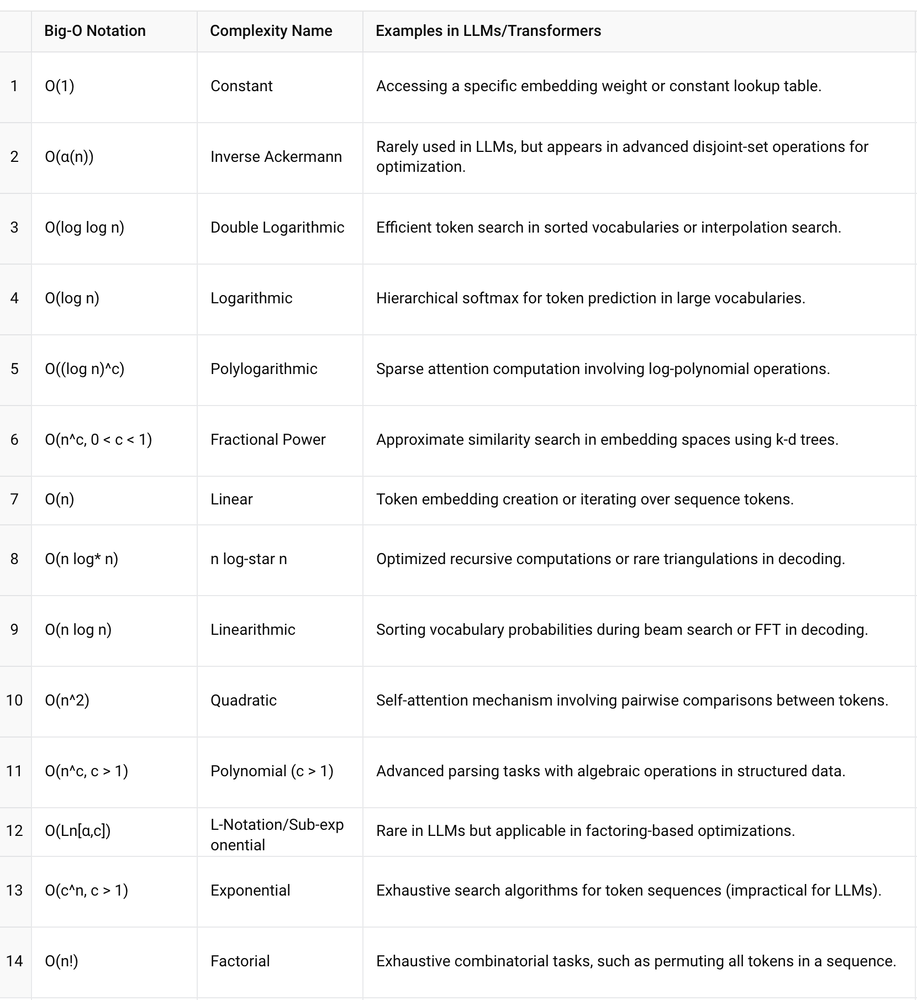

# Arrays and Time Complexity

## Theory

### Arrays

An array is a linear data structure that collects elements of the same data type and adds them into contiguous and adjacent memory locations.

* **Characteristics**: Fixed size, indexed access.
* **Advantages**: Fast access (O(1)) if index is known.
* **Disadvantages**: Transformation (resizing) is expensive (O(n)).

### Time Complexity

Time complexity quantifies the amount of time taken by an algorithm to run as a function of the length of the string representing the input.

* **Big O Notation**: Describes the upper bound of the time complexity.
  * O(1): Constant time
  * O(log n): Logarithmic time
  * O(n): Linear time
  * O(n log n): Linearithmic Time
  * O(n^2): Quadratic time
  * O(2^n): Exponential Time
  * O(n!): Factorial Time

### Brief Explanation of all the notations w.r.t LLMs 
Explanation of the 14 Notation with examples in Large Language Models(LLMs) and Transformers

## Implementation Details

See `src/ArrayOperations.java` for basic array manipulations.
